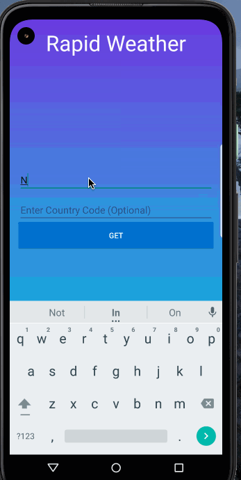

# Rapid Weather

#### Purpose: To provide real-time weather information on the go

Traveling without knowing the weather can be a hassle.  The goal of Rapid Weather is to provide users with the ability to check up-to-date weather conditions as they travel.   Additionally, users can access any city's weather data from across the world as long as they possess internet access.

#### Usage: 

Below is an example of the application in use:

